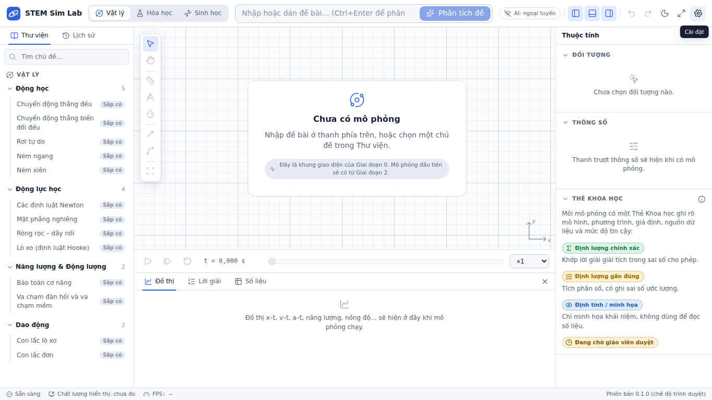

# STEM Sim Lab

Ứng dụng desktop chạy offline, mô phỏng **Vật lý · Hóa học · Sinh học** cho học sinh THPT, giáo
viên và giám khảo các cuộc thi Khoa học Kỹ thuật.

Nguyên tắc cốt lõi: **mọi con số do engine tính.** AI chỉ đọc đề và diễn giải kết quả. Mỗi mô
phỏng có một _Thẻ Khoa học_ ghi rõ mô hình, giả định, nguồn và mức độ tin cậy.



## Bắt đầu nhanh

1. Cài công cụ theo [docs/SETUP_WINDOWS.md](docs/SETUP_WINDOWS.md) (Build Tools, Rust, Node.js, Git).
2. Mở PowerShell trong thư mục dự án, rồi chạy:
   ```powershell
   npm install
   npm run tauri dev
   ```

## Tài liệu

- [MASTER_PROMPT.md](MASTER_PROMPT.md): đề bài gốc và lộ trình
- [CLAUDE.md](CLAUDE.md): quy ước dự án và lệnh build/test
- [docs/ARCHITECTURE.md](docs/ARCHITECTURE.md): kiến trúc
- [docs/SCIENCE_ACCURACY.md](docs/SCIENCE_ACCURACY.md): độ chính xác khoa học (nộp kèm hồ sơ thi)
- [docs/DATA_REVIEW.md](docs/DATA_REVIEW.md): dữ liệu chờ giáo viên duyệt
- [docs/PERFORMANCE.md](docs/PERFORMANCE.md): ngân sách và kết quả đo hiệu năng
- [docs/USER_GUIDE.md](docs/USER_GUIDE.md): hướng dẫn sử dụng

## Công nghệ

Tauri 2 (Rust) · React 19 + TypeScript (strict) · Vite 8 · Zustand · Lucide · Vitest.
Sẽ thêm ở các giai đoạn sau: PixiJS / three.js, Rapier, RDKit.js, KaTeX, uPlot, Zod, SQLite.
